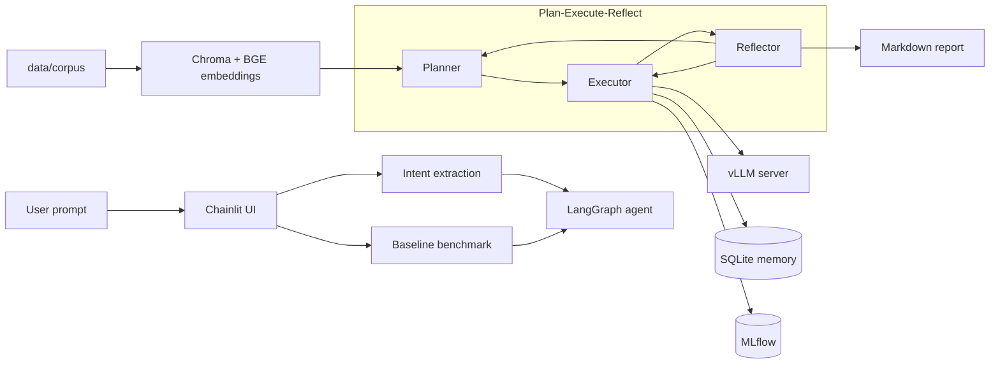

# inferops-agent

InferOps is a local LLM inference optimization agent for vLLM. It takes a
natural-language serving goal, runs a small set of benchmark experiments, and
generates a final Markdown report with the best configuration it found.

The project is built around a constrained but realistic setup: Qwen2.5 running
on an RTX 3060 Laptop GPU with 6 GB VRAM. The goal is not to build a generic
cloud autotuner; it is to show an end-to-end agent that can plan, execute,
measure, reflect, and explain optimization decisions on local hardware.

## What I Built

- A LangGraph Plan -> Execute -> Reflect agent for iterative vLLM tuning.
- A benchmark runner that measures throughput, latency, GPU utilization, and
  VRAM usage against local vLLM.
- A SQLite experiment memory so runs can be queried, compared, and reused.
- Tool wrappers for proposing configs, running benchmarks, analyzing
  bottlenecks, comparing experiments, retrieving prior results, and writing
  reports.
- A small RAG knowledge base over vLLM concepts such as PagedAttention,
  chunked prefill, prefix caching, and scheduling.
- A Chainlit UI that goes from natural-language input to final report.
- A CI-safe eval harness with random/greedy baselines and a regression gate.

## Architecture



The LangGraph state graph can be regenerated from code:

```bash
python scripts/print_agent_graph.py
```

## Stack

- vLLM 0.18
- LangGraph 1.x
- Chainlit
- Pydantic v2
- SQLite + MLflow
- Chroma + `BAAI/bge-base-zh-v1.5`
- OpenRouter / DeepSeek / Anthropic LLM backends
- pytest, 153 tests

## Quick Start

Create the project environment:

```bash
uv venv --python /home/chris/miniconda3/envs/vllm-dev/bin/python3.11 .venv
source .venv/bin/activate
uv pip install -e ".[dev,ui]"
```

Create `.env` for the default OpenRouter backend:

```bash
OPENROUTER_API_KEY=sk-or-v1-...
OPENROUTER_MODEL=deepseek/deepseek-chat
INFEROPS_LLM=openrouter
```

Build the local knowledge index:

```bash
python scripts/build_corpus.py
```

Start vLLM in terminal 1:

```bash
VLLM_GPU_MEM=0.65 bash scripts/start_vllm.sh 1.5B
```

Start Chainlit in terminal 2:

```bash
source .venv/bin/activate
chainlit run app.py --port 8001
```

Open `http://localhost:8001` and try:

```text
I have Qwen2.5-1.5B on RTX 3060, chat scenario, target QPS=10
```

The UI extracts the workload, runs or loads the baseline, streams each agent
step, and writes the final report to `reports/<session_prefix>final_report.md`.

## Example Output

A recent Chainlit run on `chat_short` with Qwen2.5-1.5B completed the full loop:

| Experiment | Change | RPS | vs baseline |
|---|---|---:|---:|
| baseline | default | 7.780 | +0.0% |
| best | `max_num_batched_tokens=3072` | 7.862 | +1.0% |

The session ran baseline plus three follow-up experiments, stopped after three
non-improving attempts, and generated a final Markdown report.

## Eval Snapshot

| Area | Current status |
|---|---:|
| Unit tests | 153 |
| Golden workloads | 5 |
| Grid-sweep ground truth | 60 rows |
| Tool registry | 9 tools |
| RAG corpus | 6 documents |

Run tests:

```bash
pytest -q
```

Run the CI-safe eval harness:

```bash
python scripts/run_eval.py --mock --commit-sha $(git rev-parse --short HEAD) \
  --ground-truth tests/fixtures/ground_truth \
  --workloads chat_short long_generation \
  --budget 2 --seed 7
```

## Repository Layout

```text
inferops/
  agent/       LangGraph planner, executor, reflector, and state
  eval/        eval harness, metrics, judge, regression gate
  memory/      SQLite experiment memory
  rag/         Markdown chunking, BGE embeddings, Chroma store
  tools/       benchmark, compare, bottleneck, memory, report, RAG tools
configs/       vLLM search-space configs
workloads/     workload definitions and prompt generators
scripts/       run_agent, run_eval, build_corpus, start_vllm, graph export
data/          corpus and ground-truth fixtures
tests/         unit tests
reports/       curated reports and generated local session reports
```

## Notes

- vLLM runs from the separate `vllm-dev` conda environment; the agent and UI run
  from `.venv`.
- `VLLM_GPU_MEM=0.65` is useful on 6 GB RTX 3060 systems where Windows/WSL is
  already using VRAM.
- The Chainlit benchmark path uses non-streaming vLLM requests to avoid an
  `httpx` / `anyio` streaming cleanup deadlock observed during debugging.

## License

Apache-2.0. See [LICENSE](LICENSE).
