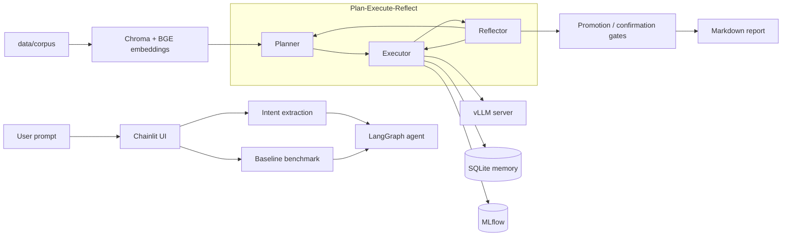

# inferops-agent

**Chinese:** [README.zh.md](README.zh.md)

InferOps is a **constrained experiment-decision system** for local vLLM tuning on
an RTX 3060 Laptop GPU (6 GB VRAM) with Qwen2.5. It plans small benchmark
experiments, measures them, and **keeps the baseline when evidence is
insufficient**—not a LangGraph/RAG autotuner that always ships a “best config.”

The featured live planner run returned `no_reliable_improvement` and kept the
baseline at **18.135 rps** (SHA `26dd06f`).

**Interview pack** (frozen docs and demo pin): see
[`reports/internship_case/interview.md`](reports/internship_case/interview.md)
at freeze SHA **`2731bed`**. This README describes the current repository; it
does **not** retarget the interview/demo SHA to later merges.

## What this is

- A LangGraph Plan → Execute → Reflect loop over a small, gated search space.
- Promotion and confirmation gates decide **adopt** versus **keep baseline**. The
  loop can stop without promoting a candidate.
- A benchmark runner for throughput, latency, GPU utilization, and VRAM against
  local vLLM. It supports a managed lifecycle or an external server started with
  `scripts/start_vllm.sh`.
- SQLite experiment memory with hardware fingerprints for compatible-history
  matching. A CPU pre-experiment (PR #64) supports a lasting exact-config
  failure filter; it does **not** prove that memory reduces wasted trials in live
  GPU runs.
- Tool wrappers for configs, benchmarks, bottleneck analysis, comparison,
  memory, and reports. Throughput compare has no synthesized CI (single-run
  aggregates; unavailable ≠ “not significant”); latency CI needs raw samples.
- A small Chroma + BGE corpus over vLLM documentation. Document citations only
  verify the existence of matching `(chunk_id, source, version)` tuples; they do
  not establish that the planner semantically understood or used the text.
- A Chainlit UI from a natural-language goal to a session report.
- A CI-safe eval harness with baselines and a regression gate.

## Architecture

Promotion and confirmation gates run after measurement. A candidate is adopted
only when the evidence clears the thresholds; otherwise the baseline is kept.


```mermaid
flowchart LR
    User[User prompt] --> UI[Chainlit UI]
    UI --> Intent[Intent extraction]
    UI --> Baseline[Baseline benchmark]
    Intent --> Agent[LangGraph agent]
    Baseline --> Agent

    Corpus[data/corpus] --> RAG[Chroma + BGE embeddings]
    RAG --> Planner[Planner]

    subgraph Plan-Execute-Reflect
      Planner --> Executor[Executor]
      Executor --> Reflector[Reflector]
      Reflector --> Planner
      Reflector --> Executor
    end

    Executor --> VLLM[vLLM server]
    Executor --> DB[(SQLite memory)]
    Executor --> MLflow[(MLflow)]
    Reflector --> Gates[Promotion / confirmation gates]
    Gates --> Report[Markdown report]
```

Regenerate the LangGraph diagram from code:

```bash
.venv/bin/python scripts/print_agent_graph.py
```

## Live results (do not rank strategies)

| Arm | Result | SHA | Claim |
|---|---|---|---|
| Planner (adopted) | **18.135 rps** baseline kept | `26dd06f` | `no_reliable_improvement`—production keep-baseline |
| Search (observed) | **19.145 rps** | `277167e` | observe-after-pick protocol score; **unconfirmed** |

`confirmed_gain` is `null`. These results have different SHAs and different
`claim_level` values. This is an exploratory comparison, **not** a strategy
ranking. Do **not** say that planner beat search, or that search beat planner at
the adoption level.

Confirmation on the live case **never ran**: the candidate’s **+3.77%**
improvement was below the **5%** threshold.

SQLite history and hardware fingerprints exist. PR #64 was a CPU A/B/C
pre-experiment that retained the B-style lasting exact-config failure filter.
It is **not** a live result showing that memory reduces wasted trials. There is
no GraphRAG.

## Stack

- vLLM (`vllm>=0.8.0` in `pyproject.toml`; use a local `vllm-dev` environment)
- LangGraph
- Chainlit
- Pydantic v2
- SQLite + MLflow
- Chroma + `BAAI/bge-base-zh-v1.5` (retrieval and existence citations only)
- OpenRouter / DeepSeek / Anthropic LLM backends
- pytest (**664** tests collected in this tree via `pytest --collect-only`)

## Quick start

The agent and UI use the project `.venv`. Create it if needed, then install the
project in editable mode:

```bash
python3 -m venv .venv
source .venv/bin/activate
python -m pip install -e ".[dev,ui]"
```

Do **not** use `uv run` for routine project commands.

Create `.env` for the default OpenRouter backend:

```bash
OPENROUTER_API_KEY=sk-or-v1-...
OPENROUTER_MODEL=deepseek/deepseek-chat
INFEROPS_LLM=openrouter
```

Build the local knowledge index:

```bash
.venv/bin/python scripts/build_corpus.py
```

By default, the agent starts and manages a local vLLM child process. For manual
debugging or an external server, start one separately:

```bash
# Terminal 1 — external server (optional)
export INFEROPS_VLLM_PYTHON=/path/to/vllm-dev/bin/python
VLLM_GPU_MEM=0.65 bash scripts/start_vllm.sh 1.5B
```

On a 6 GB RTX 3060 under Windows/WSL, lower `VLLM_GPU_MEM` if other processes
leave too little free VRAM for startup.

Start Chainlit:

```bash
# Terminal 2
source .venv/bin/activate
chainlit run app.py --port 8001
```

Open `http://localhost:8001` and try:

```text
I have Qwen2.5-1.5B on RTX 3060, chat scenario, target QPS=10
```

The UI extracts the workload, runs or loads the baseline, streams agent steps,
and writes a session report under `reports/`. The report may conclude **keep
baseline** when the gates do not clear.

## Eval snapshot

| Area | Current status |
|---|---|
| Unit / CPU tests | **664** collected (`pytest --collect-only` in this worktree) |
| Golden workloads | 5 |
| Grid-sweep ground truth | 60 rows |
| Tool registry | 9 tools |
| RAG corpus | 6 documents (existence citations, not semantic proof) |

Run tests:

```bash
PYTHONPATH=. python -m pytest -q
```

Run the CI-safe eval harness:

```bash
PYTHONPATH=. python scripts/run_eval.py \
  --mock --commit-sha $(git rev-parse --short HEAD) \
  --ground-truth tests/fixtures/ground_truth \
  --workloads chat_short long_generation \
  --budget 2 --seed 7
```

## Repository layout

```text
inferops/
  agent/       LangGraph planner, executor, reflector, and state
  eval/        eval harness, metrics, judge, regression gate
  memory/      SQLite experiment memory + hardware fingerprint
  rag/         Markdown chunking, BGE embeddings, Chroma store
  tools/       benchmark, compare, bottleneck, memory, report, RAG tools
configs/       vLLM search-space configs
workloads/     workload definitions and prompt generators
scripts/       run_agent, run_eval, build_corpus, start_vllm, graph export
data/          corpus and ground-truth fixtures
tests/         unit / CPU tests
reports/       internship case pack, curated reports, local session reports
```

## Notes

- vLLM typically runs from a separate conda environment named `vllm-dev`.
  `INFEROPS_VLLM_PYTHON` or `VLLM_PYTHON` is **required** — `scripts/start_vllm.sh`
  fails closed if neither is set. The agent and UI use the project `.venv`.
- `VLLM_GPU_MEM=0.65` or a lower value may help on a 6 GB RTX 3060 when
  Windows/WSL already occupies VRAM.
- The Chainlit benchmark path uses non-streaming vLLM requests to avoid an
  `httpx` / `anyio` streaming cleanup deadlock observed during debugging.
- Current validation covers a local RTX 3060 with Qwen2.5. It does not establish
  results for datacenter GPUs or other models.

## License

Apache-2.0. See [LICENSE](LICENSE).
