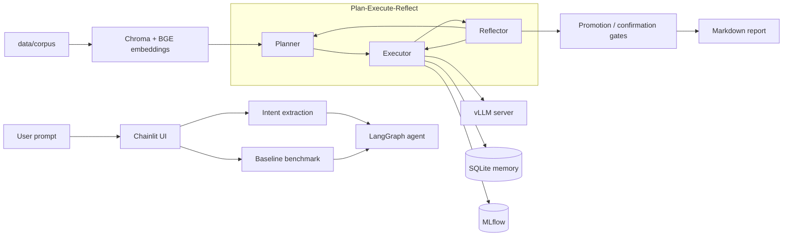

# inferops-agent

InferOps is a **constrained experiment-decision system** for local vLLM tuning on
an RTX 3060 Laptop GPU (6 GB VRAM) with Qwen2.5. It plans small benchmark
experiments, measures them, and **keeps the baseline when evidence is
insufficient** — not a LangGraph/RAG auto-tune that always ships a “best config.”

The featured live planner run returned `no_reliable_improvement` and kept the
baseline at **18.135 rps** (SHA `26dd06f`). That is the honest product story.

**Interview pack** (frozen docs, demo pin): see
[`reports/internship_case/interview.md`](reports/internship_case/interview.md)
at freeze SHA **`2731bed`**. This README describes the repo as of current
master; it does **not** retarget the interview/demo SHA to later merges.

## What this is

- A LangGraph Plan → Execute → Reflect loop over a small, gated search space.
- Promotion and confirmation gates decide **adopt** vs **keep baseline** — the
  loop can stop without promoting a candidate.
- A benchmark runner for throughput, latency, GPU utilization, and VRAM against
  local vLLM (managed lifecycle, or an external server via `scripts/start_vllm.sh`).
- SQLite experiment memory with hardware fingerprinting for compatible-history
  matching. A CPU pre-experiment (PR #64) supports a lasting exact-config
  failure filter; it does **not** prove live waste reduction on GPU.
- Tool wrappers for configs, benchmarks, bottlenecks, compare, memory, and
  reports.
- A small Chroma + BGE corpus over vLLM docs. Document citations are
  **existence-only** structured `(chunk_id, source, version)` when retrieved —
  not semantic grounding that the planner “understood” the text.
- A Chainlit UI from natural-language goal to session report.
- A CI-safe eval harness with baselines and a regression gate.

## Architecture

Promotion / confirmation gates sit after measurement: a candidate is only adopted
when evidence clears the thresholds; otherwise the system keeps the baseline.


```mermaid
flowchart LR
    User[User prompt] --> UI[Chainlit UI]
    UI --> Intent[Intent extraction]
    UI --> Baseline[Baseline benchmark]
    Intent --> Agent[LangGraph agent]
    Baseline --> Agent

    Corpus[data/corpus] --> RAG[Chroma + BGE embeddings]
    RAG --> Planner[Planner]

    subgraph Plan-Execute-Reflect
      Planner --> Executor[Executor]
      Executor --> Reflector[Reflector]
      Reflector --> Planner
      Reflector --> Executor
    end

    Executor --> VLLM[vLLM server]
    Executor --> DB[(SQLite memory)]
    Executor --> MLflow[(MLflow)]
    Reflector --> Gates[Promotion / confirmation gates]
    Gates --> Report[Markdown report]
```

Regenerate the LangGraph diagram from code:

```bash
/home/chris/Projects/inferops-agent/.venv/bin/python scripts/print_agent_graph.py
```

## Live results (do not rank strategies)

| Arm | Result | SHA | Claim |
|---|---|---|---|
| Planner (adopted) | **18.135 rps** baseline kept | `26dd06f` | `no_reliable_improvement` — production keep-baseline |
| Search (observed) | **19.145 rps** | `277167e` | observe-after-pick protocol score; **unconfirmed** |

`confirmed_gain` is `null`. Different SHAs and claim levels — this is an
exploratory compare, **not** a strategy ranking. Do **not** say the planner beat
search (or the reverse) at adoption.

Confirmation on the live case **never ran**: the best candidate was 3.77% below
the 5% threshold.

Memory: SQLite history + hardware fingerprints exist. PR #64 (CPU A/B/C) kept the
B-style lasting exact-config filter; it is **not** a live “memory reduces wasted
trials” result. No GraphRAG.

## Stack

- vLLM (`vllm>=0.8.0` in `pyproject.toml`; use your local `vllm-dev` env version)
- LangGraph
- Chainlit
- Pydantic v2
- SQLite + MLflow
- Chroma + `BAAI/bge-base-zh-v1.5` (retrieval / existence citations only)
- OpenRouter / DeepSeek / Anthropic LLM backends
- pytest (**623** tests collected in this tree via `pytest --collect-only`; see CI)

## Quick Start

Agent/UI Python (shared project venv on this machine):

```bash
PYTHON=/home/chris/Projects/inferops-agent/.venv/bin/python
```

To create a local editable install into that venv (or your own `.venv`):

```bash
# example: project venv already present
$PYTHON -m pip install -e ".[dev,ui]"
```

Do **not** use `uv run` for day-to-day agent commands here.

Create `.env` for the default OpenRouter backend:

```bash
OPENROUTER_API_KEY=sk-or-v1-...
OPENROUTER_MODEL=deepseek/deepseek-chat
INFEROPS_LLM=openrouter
```

Build the local knowledge index:

```bash
$PYTHON scripts/build_corpus.py
```

**vLLM:** the agent’s default path manages a local vLLM child process. For an
external server (manual / debugging), start one separately:

```bash
# Terminal 1 — external server (optional)
VLLM_GPU_MEM=0.65 bash scripts/start_vllm.sh 1.5B
```

On 6 GB RTX 3060 + Windows/WSL VRAM pressure, lower `VLLM_GPU_MEM` if startup
fails for free memory.

Start Chainlit:

```bash
# Terminal 2
source /home/chris/Projects/inferops-agent/.venv/bin/activate   # or your .venv
chainlit run app.py --port 8001
```

Open `http://localhost:8001` and try:

```text
I have Qwen2.5-1.5B on RTX 3060, chat scenario, target QPS=10
```

The UI extracts the workload, runs or loads the baseline, streams agent steps,
and writes a session report under `reports/`. The report may conclude **keep
baseline** when gates do not clear.

## Eval Snapshot

| Area | Current status |
|---|---|
| Unit / CPU tests | **623** collected (`pytest --collect-only` in this worktree) |
| Golden workloads | 5 |
| Grid-sweep ground truth | 60 rows |
| Tool registry | 9 tools |
| RAG corpus | 6 documents (existence citations, not semantic proof) |

Run tests:

```bash
PYTHONPATH=. /home/chris/Projects/inferops-agent/.venv/bin/python -m pytest -q
```

Run the CI-safe eval harness:

```bash
PYTHONPATH=. /home/chris/Projects/inferops-agent/.venv/bin/python scripts/run_eval.py \
  --mock --commit-sha $(git rev-parse --short HEAD) \
  --ground-truth tests/fixtures/ground_truth \
  --workloads chat_short long_generation \
  --budget 2 --seed 7
```

## Repository Layout

```text
inferops/
  agent/       LangGraph planner, executor, reflector, and state
  eval/        eval harness, metrics, judge, regression gate
  memory/      SQLite experiment memory + hardware fingerprint
  rag/         Markdown chunking, BGE embeddings, Chroma store
  tools/       benchmark, compare, bottleneck, memory, report, RAG tools
configs/       vLLM search-space configs
workloads/     workload definitions and prompt generators
scripts/       run_agent, run_eval, build_corpus, start_vllm, graph export
data/          corpus and ground-truth fixtures
tests/         unit / CPU tests
reports/       internship case pack, curated reports, local session reports
```

## Notes

- vLLM typically runs from a separate `vllm-dev` conda env; the agent and UI run
  from the project `.venv` (`/home/chris/Projects/inferops-agent/.venv`).
- `VLLM_GPU_MEM=0.65` (or similar) helps on 6 GB RTX 3060 when Windows/WSL
  already holds VRAM.
- The Chainlit benchmark path uses non-streaming vLLM requests to avoid an
  `httpx` / `anyio` streaming cleanup deadlock observed during debugging.
- This is a **local 3060 / Qwen2.5** project — not a datacenter autotuner.

## License

Apache-2.0. See [LICENSE](LICENSE).
