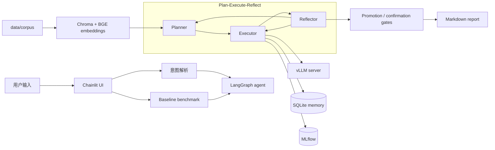

# inferops-agent

English homepage: [README.md](README.md).

InferOps 是一个面向本地 vLLM 的**受约束实验与决策系统**。当前项目以 RTX 3060
Laptop GPU（6 GB VRAM）和 Qwen2.5 为主要运行环境。系统会规划少量实验、执行测量，
并根据证据决定采用候选配置还是保留 baseline。证据不足时，它不会强行给出“最佳配置”。

代表性的 live planner 运行结果是 `no_reliable_improvement`：系统保留了
**18.135 rps** 的 baseline（SHA `26dd06f`）。

面试材料和 demo 固定在 **`2731bed`**，入口见
[`reports/internship_case/interview.md`](reports/internship_case/interview.md)。
README 描述当前仓库，但不会改变面试和 demo 的冻结 SHA。

## 项目定位

- 使用 LangGraph 实现 Plan → Execute → Reflect，搜索空间小且受代码约束。
- 由 promotion 和 confirmation gate 决定采用候选配置还是保留 baseline；循环可以在不采用
  任何候选配置的情况下结束。
- benchmark runner 测量吞吐、延迟、GPU 利用率和显存占用。默认由系统管理本地 vLLM
  进程，也可通过 `scripts/start_vllm.sh` 连接外部服务。
- 使用 SQLite 保存实验记录，并用硬件 fingerprint 筛选可兼容的历史信息。PR #64 的
  CPU 预实验支持保留 B 式 lasting exact-config failure filter；它不能证明 memory 已在
  live GPU 运行中减少 wasted trials。
- 提供配置、benchmark、瓶颈分析、结果比较、memory 和报告等工具封装。
- 使用 Chroma 和 BGE 检索小型 vLLM 文档语料。文档引用只验证
  `(chunk_id, source, version)` 是否存在且匹配，不判断语义是否支持结论。
- 提供 Chainlit UI，从自然语言目标进入实验流程并生成 session 报告。
- 提供可在 CI 中运行的 eval harness、baseline 和 regression gate。

## 系统结构

测量完成后，候选配置还要经过 promotion 和 confirmation gate。只有证据达到阈值时才会
被采用；否则保留 baseline。



从代码重新生成 LangGraph 图：

```bash
.venv/bin/python scripts/print_agent_graph.py
```

## 实测结果：不能据此比较策略优劣

| 路径 | 结果 | SHA | claim |
|---|---|---|---|
| Planner（最终采用） | 保留 **18.135 rps** baseline | `26dd06f` | `no_reliable_improvement`，生产决策为保留 baseline |
| Search（仅观测） | **19.145 rps** | `277167e` | observe-after-pick protocol score，**未确认** |

`confirmed_gain` 为 `null`。两条路径使用不同 SHA，也有不同 `claim_level`。这只是探索性
比较，不能写成 planner 胜过 search，也不能写成 search 在 adoption 层面胜过 planner。

Live case 没有运行 confirmation：候选配置的 **+3.77%** 提升低于 **5%** 阈值。

SQLite 历史记录和硬件 fingerprint 已实现。PR #64 只是 CPU A/B/C 预实验，结论是继续
使用 B 式 lasting exact-config filter。它不是 live 环境中的 wasted-trial 降低结果。
项目没有 GraphRAG。

## 技术栈

- vLLM（`pyproject.toml` 声明 `vllm>=0.8.0`；实际运行使用本地 `vllm-dev` 环境）
- LangGraph
- Chainlit
- Pydantic v2
- SQLite + MLflow
- Chroma + `BAAI/bge-base-zh-v1.5`（只用于检索和存在性引用校验）
- OpenRouter / DeepSeek / Anthropic LLM 后端
- pytest（本分支通过 `pytest --collect-only` 收集 **631** 个测试；CI 运行同一测试集）

## 快速开始

agent 和 UI 使用项目目录下的 `.venv`。如果尚未创建，可执行：

```bash
python3 -m venv .venv
source .venv/bin/activate
python -m pip install -e ".[dev,ui]"
```

日常运行本项目时不要使用 `uv run`。

默认 LLM 后端是 OpenRouter。创建 `.env`：

```bash
OPENROUTER_API_KEY=sk-or-v1-...
OPENROUTER_MODEL=deepseek/deepseek-chat
INFEROPS_LLM=openrouter
```

构建本地知识索引：

```bash
.venv/bin/python scripts/build_corpus.py
```

默认情况下，agent 会启动并管理本地 vLLM 子进程。手工调试或连接外部服务时，可在另一
终端单独启动：

```bash
# Terminal 1 — external server (optional)
VLLM_GPU_MEM=0.65 bash scripts/start_vllm.sh 1.5B
```

在 6 GB RTX 3060 和 Windows/WSL 组合下，系统与显示进程会占用部分显存。如果启动时
可用显存不足，可降低 `VLLM_GPU_MEM`。

启动 Chainlit：

```bash
# Terminal 2
source .venv/bin/activate
chainlit run app.py --port 8001
```

打开 `http://localhost:8001`，例如输入：

```text
I have Qwen2.5-1.5B on RTX 3060, chat scenario, target QPS=10
```

UI 会解析 workload，运行或加载 baseline，展示 agent 步骤，并把 session 报告写入
`reports/`。如果候选配置没有通过 gate，报告会明确要求保留 baseline。

## 评测概览

| 项目 | 当前状态 |
|---|---|
| Unit / CPU tests | **631** collected（本分支运行 `pytest --collect-only`） |
| Golden workloads | 5 |
| Grid-sweep ground truth | 60 rows |
| Tool registry | 9 tools |
| RAG corpus | 6 documents（存在性引用，不是语义证明） |

运行测试：

```bash
PYTHONPATH=. python -m pytest -q
```

运行 CI-safe eval harness：

```bash
PYTHONPATH=. python scripts/run_eval.py \
  --mock --commit-sha $(git rev-parse --short HEAD) \
  --ground-truth tests/fixtures/ground_truth \
  --workloads chat_short long_generation \
  --budget 2 --seed 7
```

## 目录结构

```text
inferops/
  agent/       LangGraph planner、executor、reflector 和 state
  eval/        eval harness、metrics、judge 和 regression gate
  memory/      SQLite 实验记录和硬件 fingerprint
  rag/         Markdown chunking、BGE embeddings 和 Chroma store
  tools/       benchmark、compare、bottleneck、memory、report 和 RAG tools
configs/       vLLM 搜索空间配置
workloads/     workload 定义和 prompt 生成器
scripts/       run_agent、run_eval、build_corpus、start_vllm、graph export
data/          corpus 和 ground-truth fixtures
tests/         unit / CPU tests
reports/       internship case pack、整理后的报告和本地 session 报告
```

## 运行说明

- vLLM 通常运行在单独的 `vllm-dev` conda 环境中，可通过
  `INFEROPS_VLLM_PYTHON` 或 `VLLM_PYTHON` 指定解释器；agent 和 UI 使用项目 `.venv`。
- 在 6 GB RTX 3060 上，如果 Windows/WSL 已占用较多显存，可使用
  `VLLM_GPU_MEM=0.65` 或更低的值。
- Chainlit benchmark 路径使用非流式 vLLM 请求，以避开调试期间观察到的
  `httpx` / `anyio` streaming cleanup deadlock。
- 当前验证范围是本地 RTX 3060 / Qwen2.5，不代表 datacenter GPU 或其他模型上的结果。

## 许可证

Apache-2.0，见 [LICENSE](LICENSE)。
